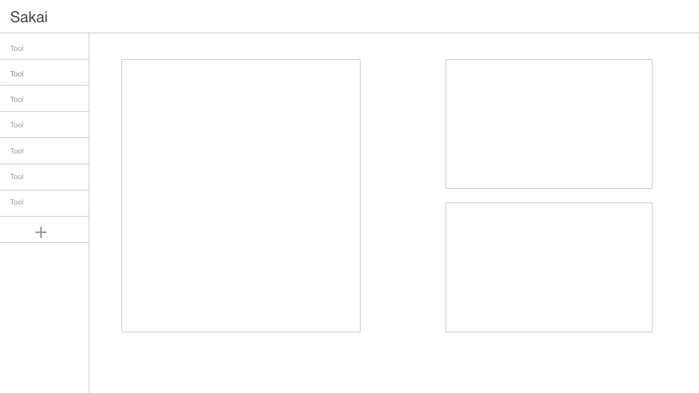

# /apps

A database of all learning technologies available to the Duke community.

### [User stories for MVP1 of /apps](https://github.com/DukeLearningInnovation/learn.duke/issues?q=is%3Aopen+is%3Aissue+label%3A%22user+story%22+project%3ADukeLearningInnovation%2Flearn.duke%2F2+milestone%3AMVP1)

* All apps and their apis
* presented via API to /courses so faculty can add apps to their courses

An app store UI built that allows searching/filtering for apps and has grouper group awareness.

A new interface for selecting and managing these apps in Sakai, indicated here by the + button on the left navigation. This overrules site info::manage tools

This calls the app store, but the UI is changed slightly as the interface knows it's inside Sakai via LTI and already knows what what group context we're in.

This should be applied to all platforms, wordpress, drupal, open edx, sakai.

## Questions on apps
* Should we include 'advertising' space for whatever apps we want to push at any given time? A featured, section.
* Do we build in a rating system for each app?
* What is a good metric for 'used' in a course? The existence of a tool in Sakai means nothing when that tool is part of the template. 2 create.tool events or existence of 1 item in the sakai-db?
* How do we incorporate OER?
* How do we incorporate library resources?

