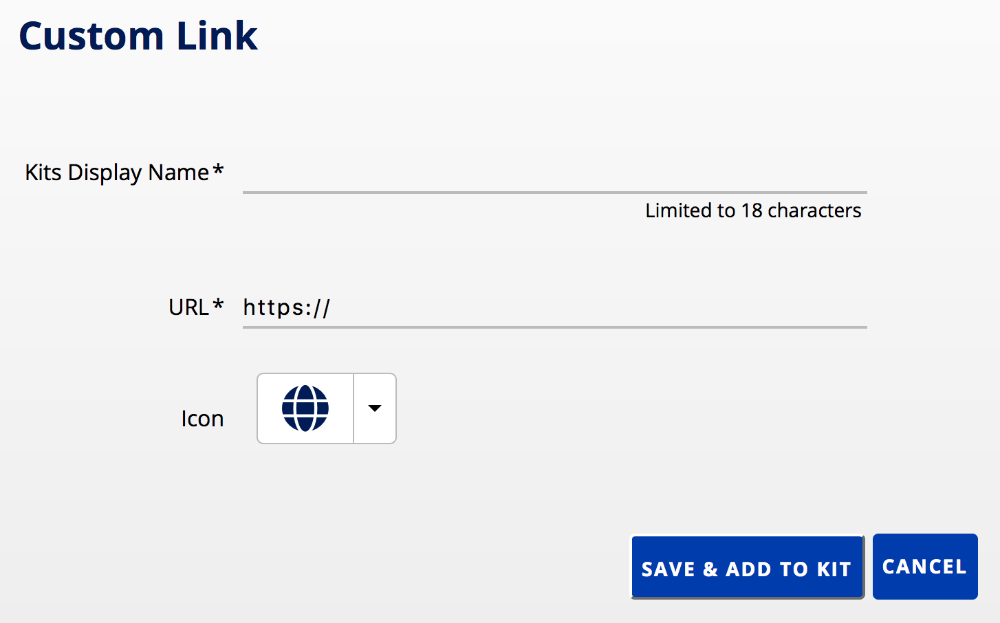

# Custom Link

## Description
Custom Link allows authors to provide a connection to any internet website. You will need to supply a URL, a short name for the link, and choose an icon.

**Price**: Free   
**Support**: [University supported](https://oit.duke.edu)   
**Accessibility**: (Links to app's accessibility statement)    
**License**:   
**Availability**: Duke Community  

{{SCREENSHOT BLOCK}}

{{PERMISSIONS BLOCK}}

## Why use Custom Link?
Creating custom links allows your students to quickly and easily locate important websites for course use. Storing them in your course kit will ensure all your students and course affiliates will have a reference point for these important sites.
<!--
### Pedagogy

#### how it alters relationship between faculty/students

#### learning science

#### affordances
-->
### Excellence & Design
Custom Link offers a simple, reliable way to store and share important internet websites with your students.

<!--
### Accessibility & Ubiquity

### Openness

### Standards-driven

### Scalable & Sustainable

### Security, Privacy, & Analytics

### Procurement & Licensing
-->
### Support
Custom Link is [supported by OIT](https://oit.duke.edu).
<!--
### Exclusions
-->
