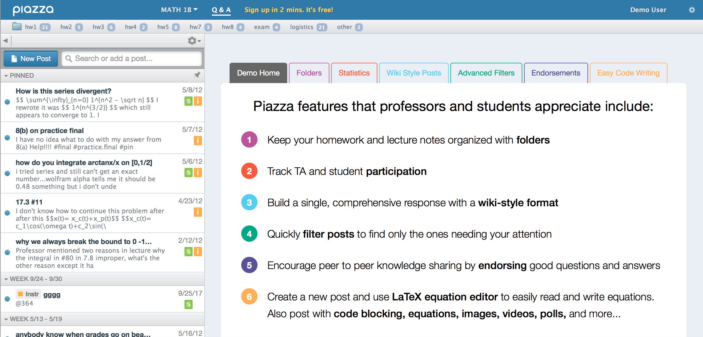

# Piazza

## Description
Piazza allows the entire learning community to ask and answer questions. Students can jointly edit a response to a fellow student's question, and the instructor can choose to approve the student answer or provide their own.

**Price**: [Free](https://piazza.com)(Links to about/app-pricing)  
**Support**: [University supported](https://oit.duke.edu)(Links to app's support page)  
**Accessibility**:[WCAG 2.0 Level A & AA compliant](https://d1b10bmlvqabco.cloudfront.net/product_files/accessibility_conformance_statement.pdf)(Links to app's accessibility statement)  
**License**: [GPLv2]()  
**Availability**: Duke Community  

{{SCREENSHOT BLOCK}}

{{PERMISSIONS BLOCK}}

## Why use Piazza?
Piazza offers a way to build knowledge among the learning community by providing students a chance to teach one another. Questions receive a relatively higher quality answer through group effort, and the answer is easier to find and reference compared to long discussion forum threads. Instructors can easily guide students by either approving answers or contributing their own. 

### Accessibility & Ubiquity
Piazza is WCAG 2.0 Level A & AA compliant and supports web and mobile accessibility.

### Support
Piazza offers a [support center](http://support.piazza.com) where both instructors and students can search help documents or email or call Piazza directly.

