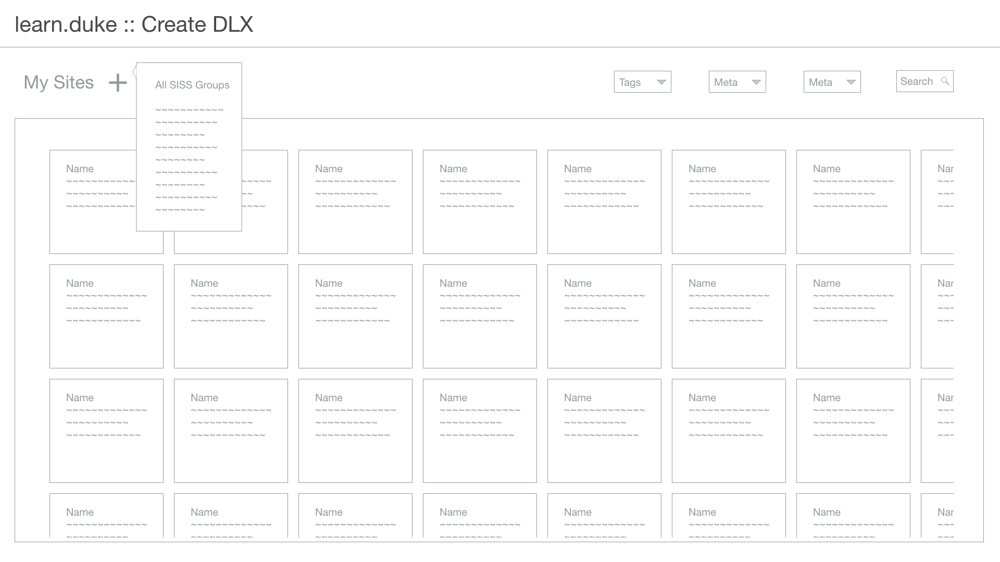

# /courses

A unified interface for accessing learning communities and the instructional tools they use. 

### [User Stories for MVP1 of /courses](https://github.com/DukeLearningInnovation/learn.duke/issues?q=is%3Aopen+is%3Aissue+label%3A%22user+story%22+project%3ADukeLearningInnovation%2Flearn.duke%2F1+milestone%3AMVP1)

learn.duke could act similarly to the Canvas landing page, as a dashboard that can send users to whatever server their learning experience lives on.

Now, users can access sakai, extend, sites@duke, people.duke, whatever course sites from the same place.

## courses start as grouper groups
Adding a new learning experience starts with the group selection. groups come from groupmanager.oit API to learn.duke

## Questions for courses
* What happens with cross-listed courses? Is there a master group that's created?
* Since a reference group is auto-generated for every roster, is a course card auto-generated or do we wait for faculty to initiate a create process?

