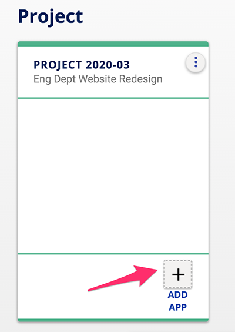
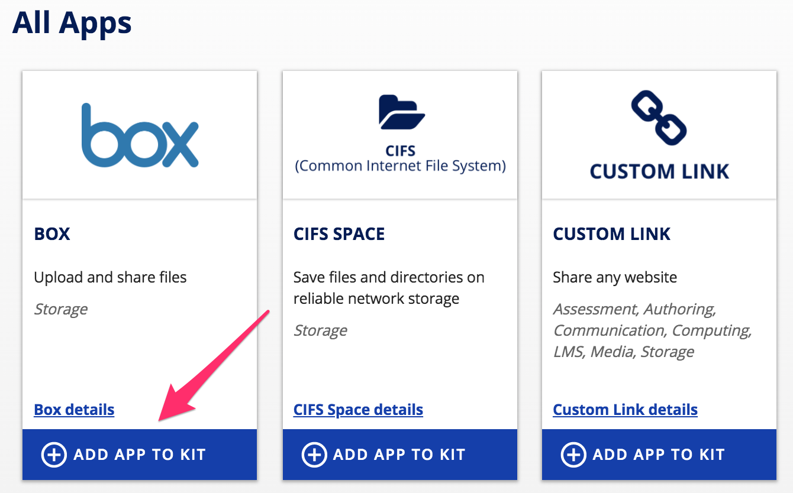
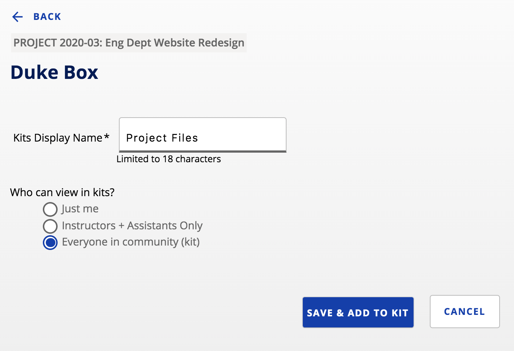
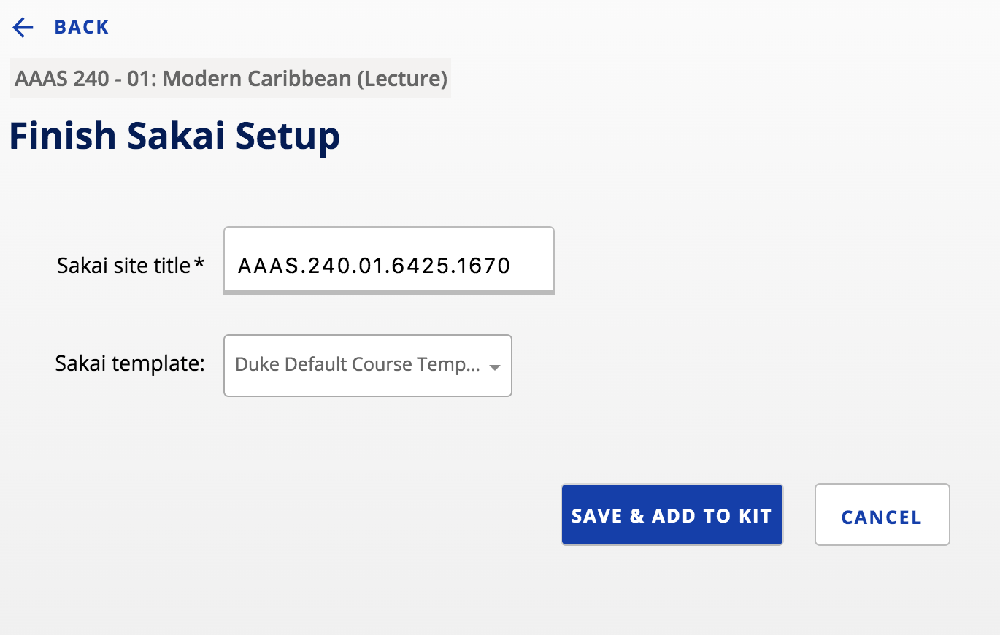
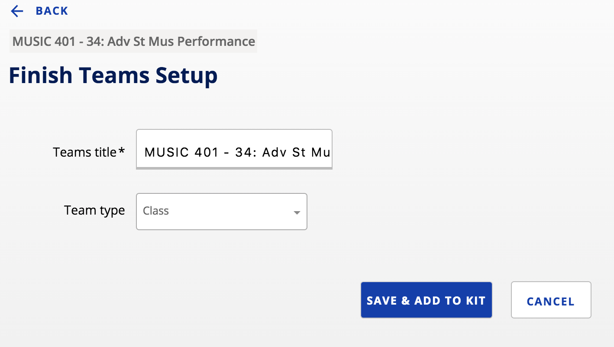
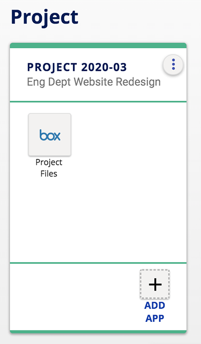

## How do I add apps to my kit?

**Click the Add App button** at the bottom of the kit.

In the Kits App Store, find the app you would like to set up.  **Click the Add App to Kit button** at the bottom of the app card.

**Enter a display name** for the app.  The display name is the text that displays under the app icon in the kit.  Next, **select who can view the app** in your kit. When finished, **click the Save & Add to Kit button** or **Save and Continue Setup**.

For some apps, such as Sakai and MS Teams, you will see an additional setup page with a name for the Sakai site or MS Team.  **It is strongly recommended that you keep the default name** so that you and students can easily find your app. If you see this additional setup page, **click the Save & Add to Kit button** when finished making your selections.

*Examples of additional setup pages for Sakai and MS Teams.*

Once your app is ready, **click the icon in your kit to access the app**.

*Note: apps may show as greyed out in the kit during the setup process.  App setup can take up to 10 minutes.*

Need to make a change to your apps?  Learn [how to Edit ](/how-do-i-edit-apps-in-my-kit.md)and [Remove apps](/how-do-i-remove-apps-from-my-kit.md) from your kit.
