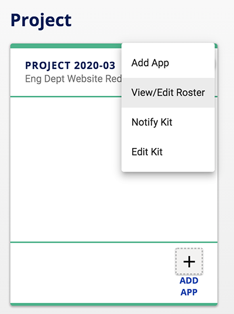
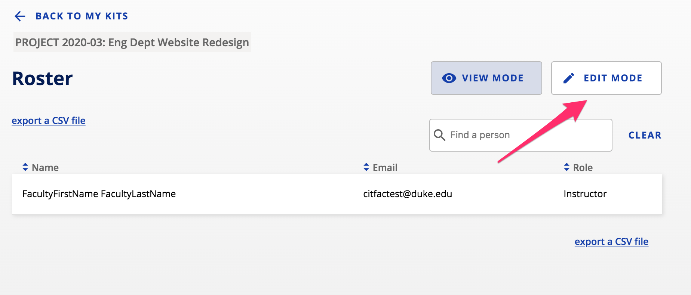
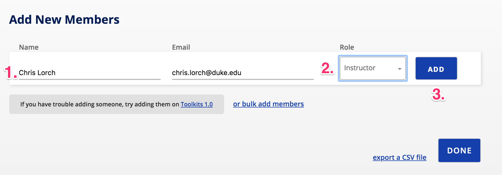
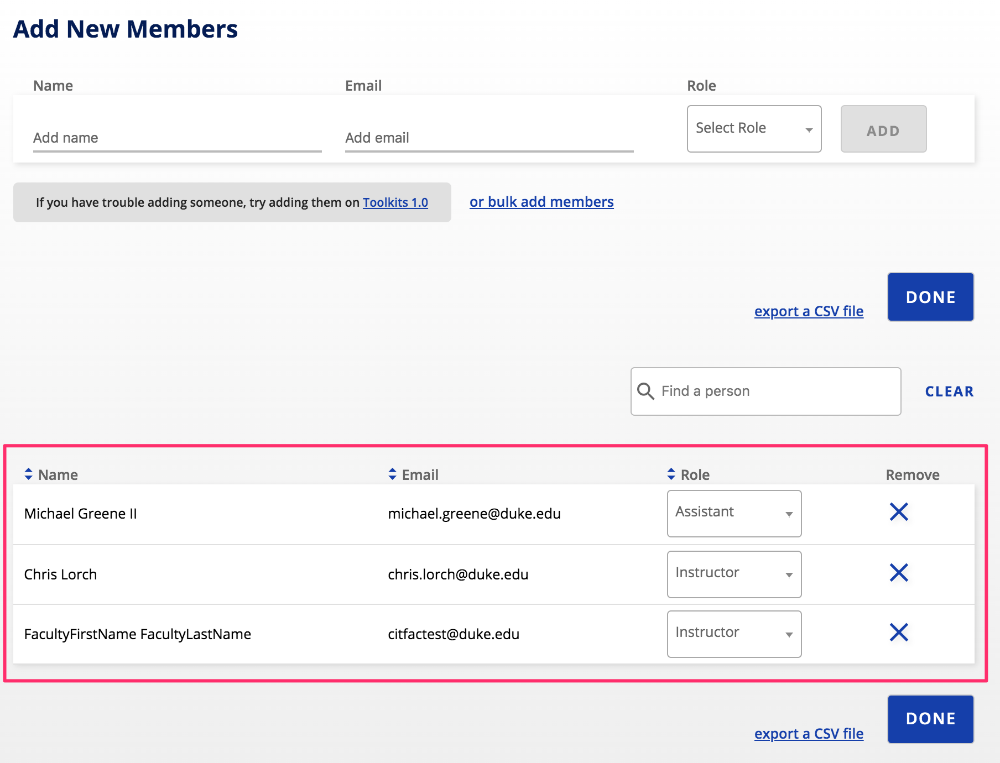

## How do I add people to my kit?

The process for adding new members to your kit is the same regardless of whether your kit is for an official Duke course or a custom kit for a project or team.

**_Note:_*** Course kits that are official Duke courses are shared with students in the course roster automatically.*

To add members to your kit, **click the menu with three vertical dots ** in the upper-right corner of your kit and **choose View/Edit Roster**.

## You will enter the View Mode which lists the current members of your kit. **Click on Edit Mode** to add members.

In Edit Mode, **type the name of the person** you would like to add to your kit i**n the Name field**.  The system will search for that person at Duke and display a result.  **Select the person** you would like to add in the results and the system will populate the Email field.  From the **Role drop-down menu, select the appropriate role** for the new member then **click the Add button**.

Repeat this process for every member you would like to add to your kit.  Once added, new members show up in the list of all kit members in the table below.

When you are done adding members to your kit, **click the Done button** to return to the main Kits page.

To **remove a member** from the kit, **click the X icon** under the Remove column in the member list.

**_Note:_*** in course kits with course rosters, students officially enrolled in the course cannot be removed.  Course roster data is automatically synced with DukeHub on a daily basis and should remain up-to-date automatically.*

Now that you have shared your kit with other people, add apps to your kit so that you can collaborate.  [Learn how to add apps to your kit](/how-do-i-add-apps-to-my-kit.md).
