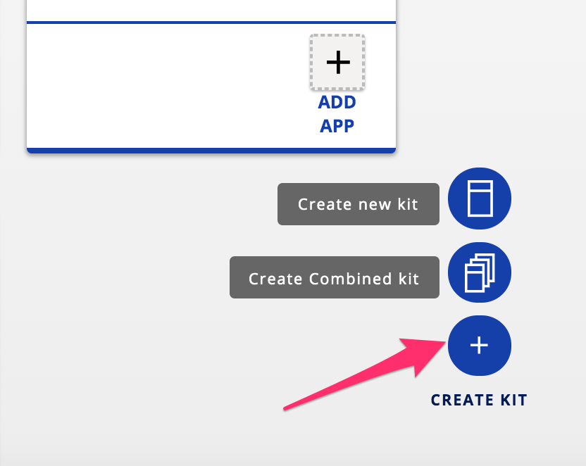
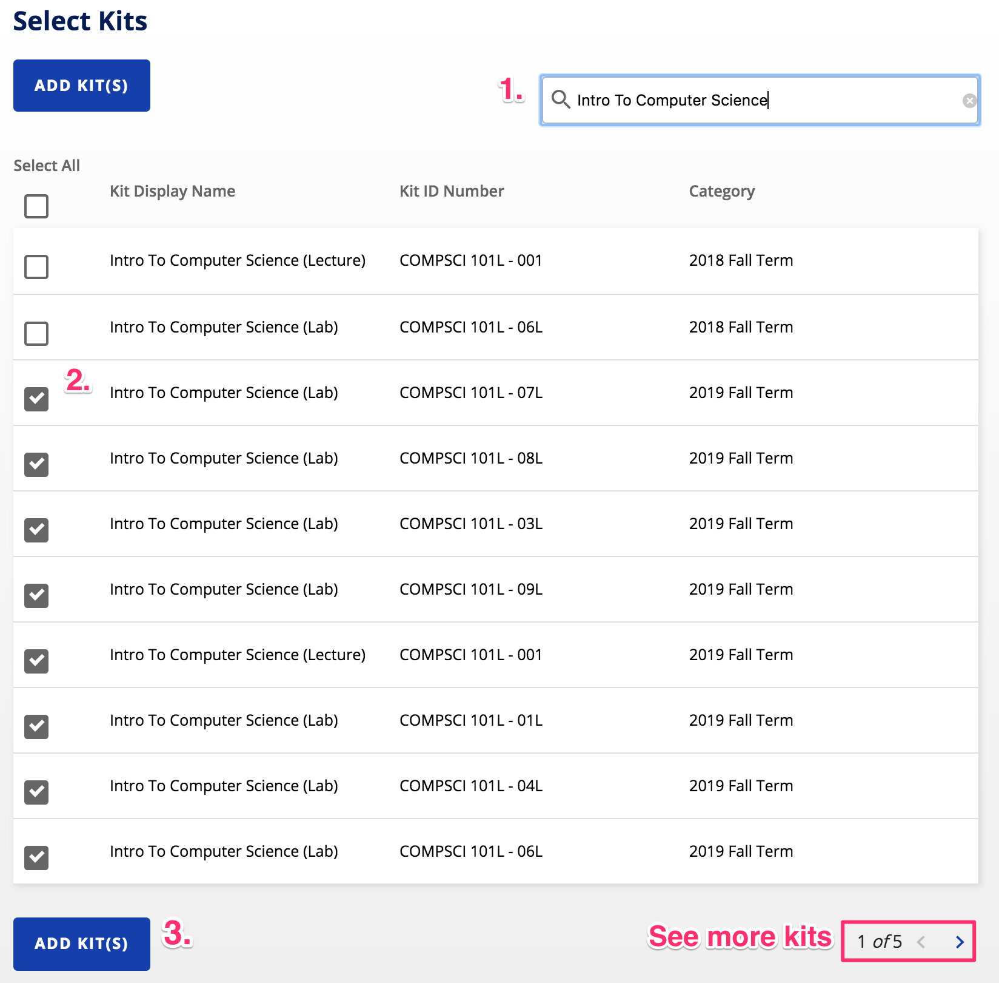
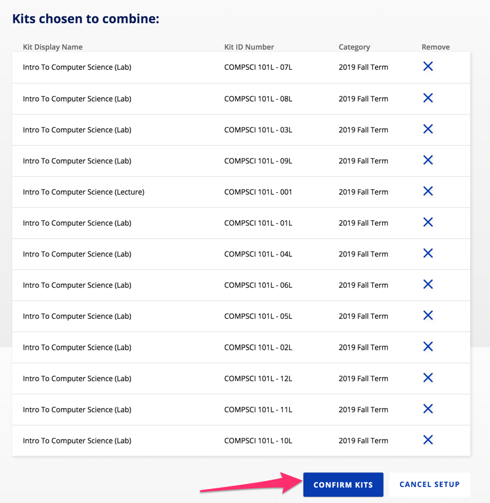
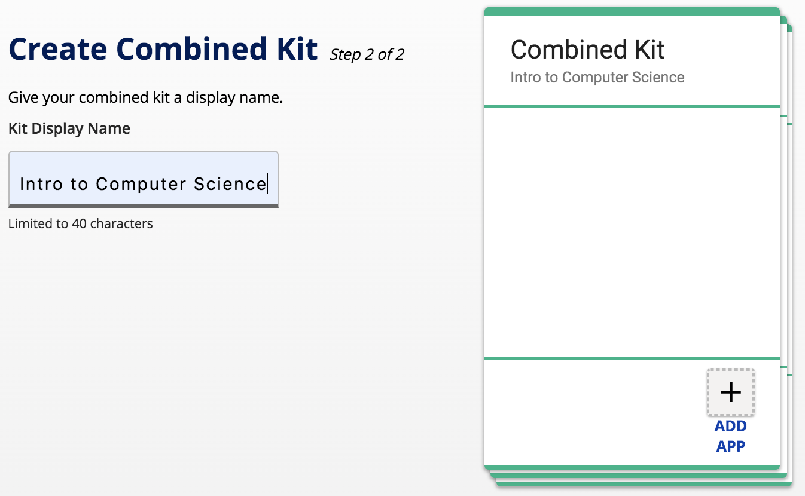
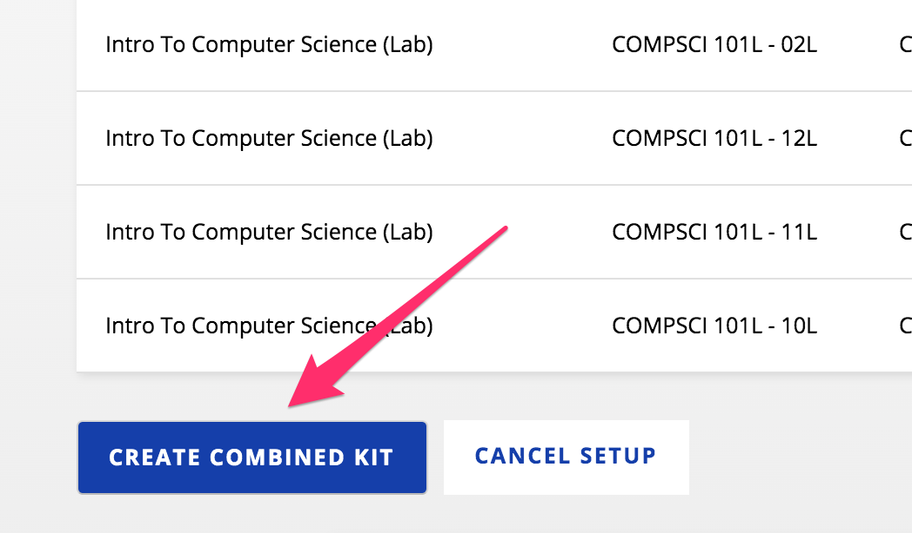
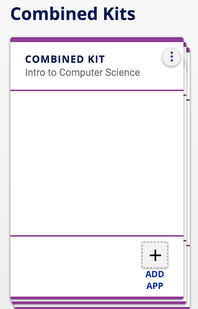
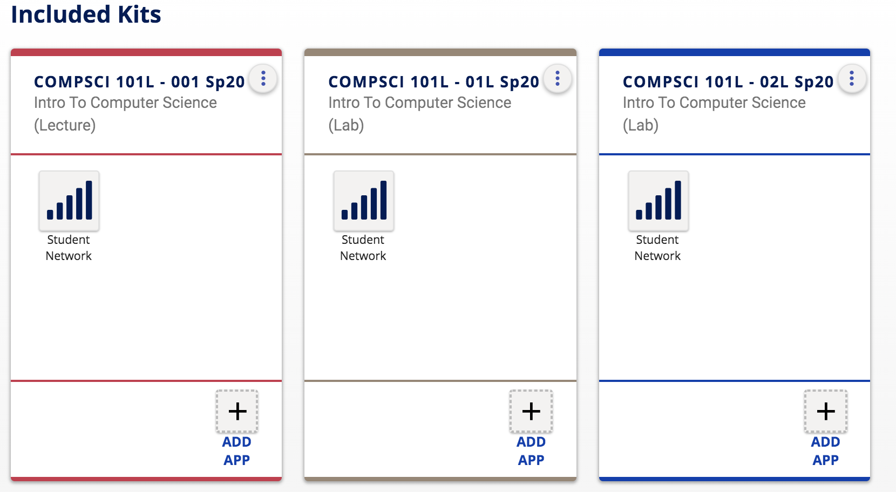
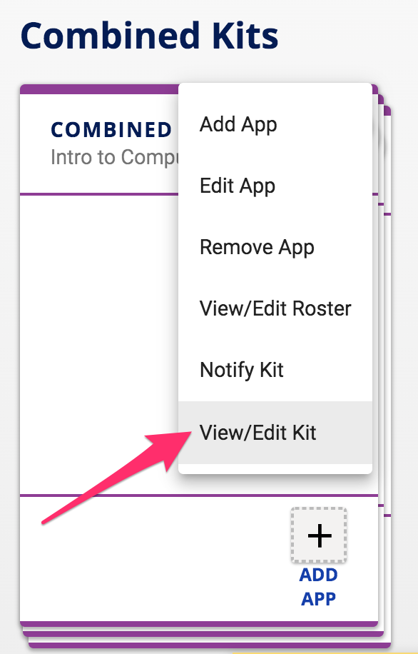

## How do I combine kits for my multi-section course?

Instructors who are teaching a course with multiple sections often need to set up a learning app that is shared with all sections.  The **Combine Kits** feature in Kits allows instructors to associate multiple course sections together..  **All learning apps added to the Combined Kit will be automatically shared with all sections in the kit.**

To create a combined kit, **click the Create Kit button** in the lower-right-hand corner of the screen then **click Create Combined kit**.

On the next screen, you will be prompted to select the kits you would like to combine.  Start by **searching for the name of the course** you would like to combine to filter results only to that course.  Next, click the **check mark next to the name of the kits** you would like to combine.  *You may need to navigate through multiple pages to select all kits.*

When you have finished selecting all kits to combine **click the Add Kits button**.

After clicking the Add Kits button, you will then see the kits you selected to combine at the top of the screen.  **To remove a kit, click the blue X in the Remove column**.  To add more kits, see the Select Kits option below.  When your combined kit list is complete,** click the Confirm Kits button**.

Next, **enter a display name** for your combined kit.  

Then scroll down and **click the Create Combined Kit button** at the bottom of the page.

You should now see your combined kit under the **Combined Kit category** in Kits.

This stacked view of your combined kit is an instructor view and allows the instructor to add apps to the combined kit to be shared with all course rosters in the combined kit.  When students login to Kits, they see a kit for the lecture section and the lab section that they are enrolled in with all apps added by the instructor.

To see all kits in the combined kit, **click the three vertical dots menu** (kebab menu) in the upper right corner of the kit.  Then click **View/Edit Kit** in the menu.

The kits included in the combined kit will be listed.  Apps may also be added to a single kit within the combined kit.  These apps will be shared only with the students and members of the individual kit.

*Note: not all kits in the combined kit in this example are shown here.*

**Click Back to My Kits** to get back to the main Kits page.

Now that you’ve created a combined kit, [learn how to add people to your kit](/how-do-i-add-people-to-my-kit.md).
