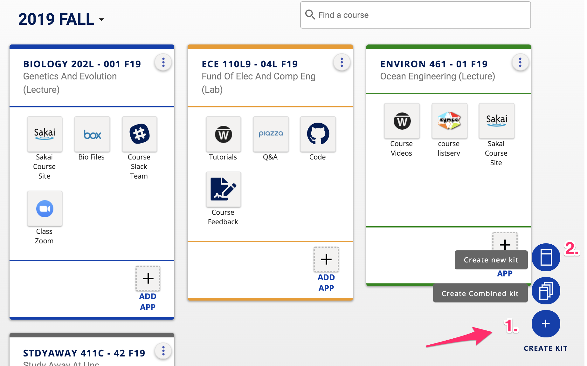
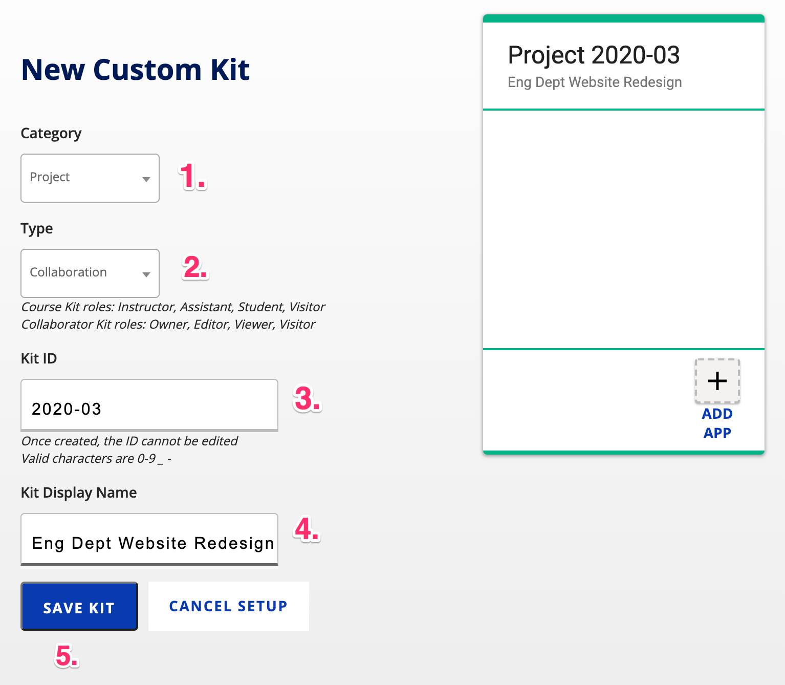
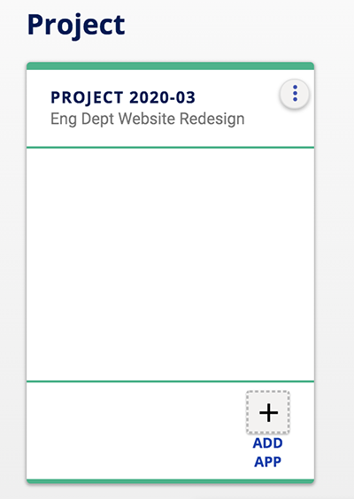

## How do I create a kit?

### Course Kits

When instructors login to Kits, they see a **kit for every course** for which they are an instructor of record in DukeHub.  Course kits are created automatically when faculty and students login to Kits.

### User-Created Kits

To set up a kit that is not an official Duke course in DukeHub, **click the Create Kit button** in the lower-right-hand corner of Kits, then **Create New Kit**. *(Interested in combining existing courses? See [**How to Combine Kits**](/how-do-i-combine-kits-for-my-multi-section-course.md).)*

The New Custom Kit setup page displays.  From the **Category** drop-down menu choose a kit type. **Enter a Kit ID** and **provide a descriptive Display Name** for your kit.  When finished, **click the Save Kit button**.

Once saved, your new kit can be found in Kits under the Project category.  If you have many kits, you may need to scroll down a little to see the Project category and your new kit.

Next, share your new kit with other project or course members.  [Learn how to add people to your kit](/how-do-i-add-people-to-my-kit.md).
