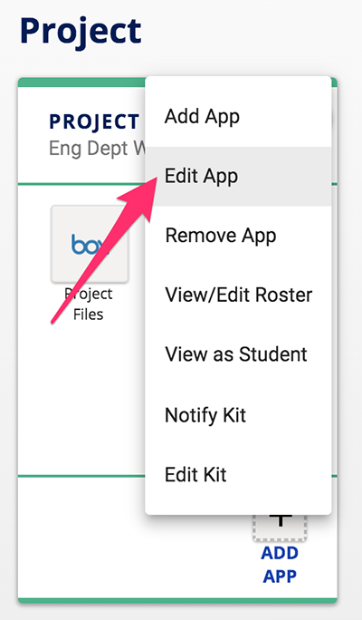
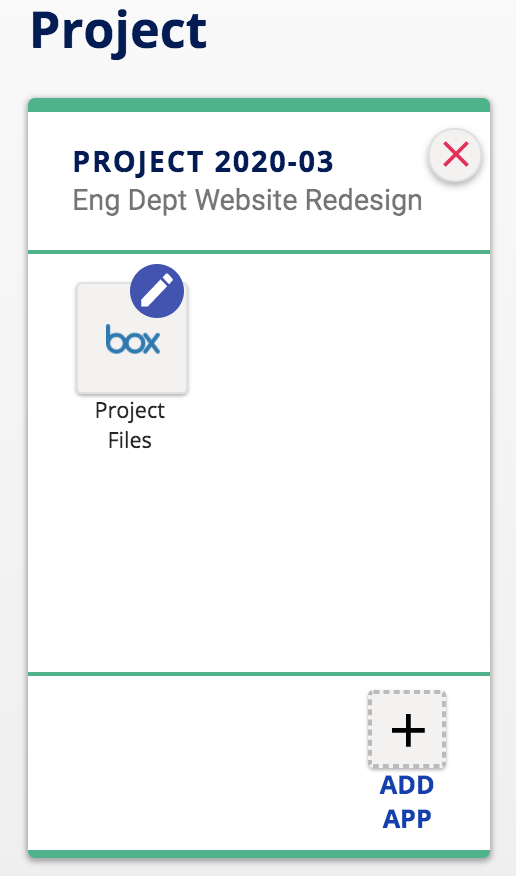
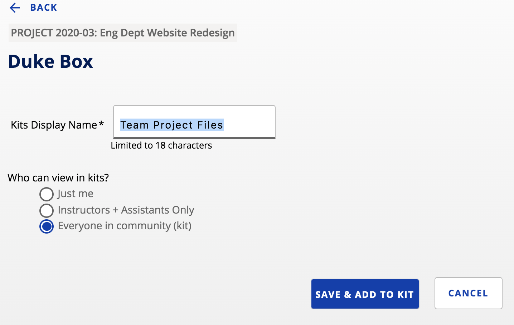
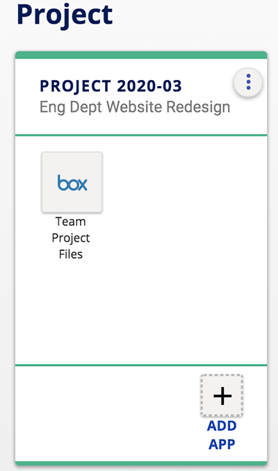
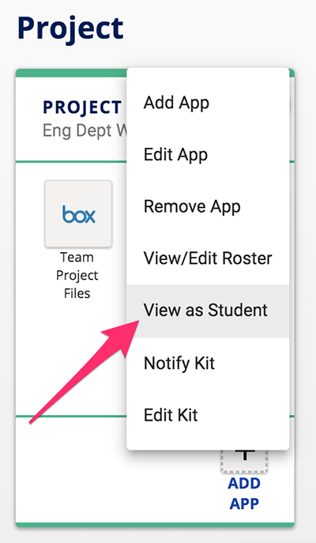

## How do I edit apps in my kit?

To edit an app in your kit, start by **click the menu with three vertical dots ** in the upper-right corner of your kit.  Then click **Edit App** in the menu.

All app icons in the kit will now show a pencil icon in the corner.  **Click the icon of the app** you wish to edit.

On the setup page, you can **edit the Kits Display Name** and the **view permissions** for the app.  After making your edits, **click the Save & Add to Kit button**.

Your kit should now show any display name edits to the app on your kit.

**Changes in permissions** can be checked by using the **View As Student option** under the vertical three dot menu (will not verify permission changes from Instructors + Assistants to Just me).

[Learn more about the View as Student feature](https://docs.google.com/document/d/1SfInmvwgTEkQIkQnuj2PoZFVhMChYocN1tnkBcFKSSs/edit?usp=sharing) in Kits.
