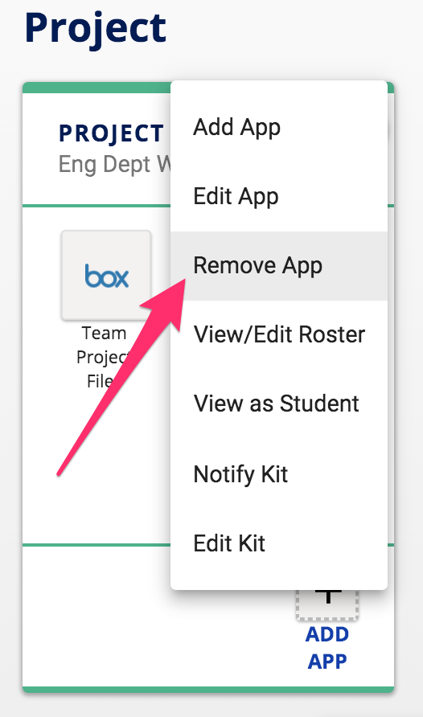
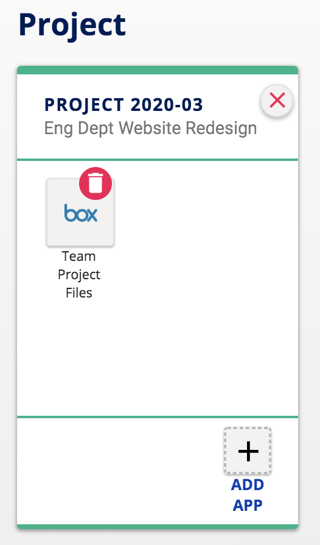
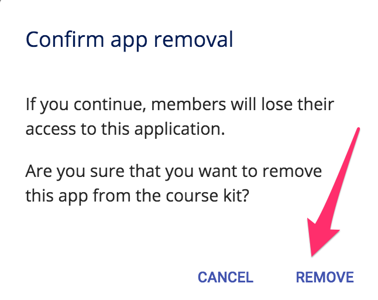
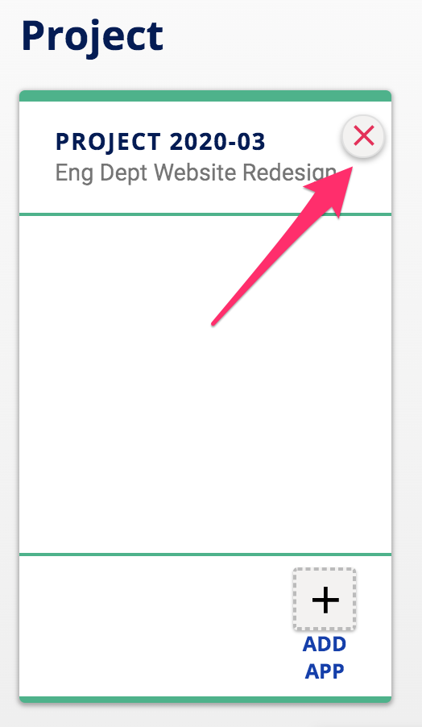

## How do I remove apps in my kit?

To remove an app in your kit, start by **click the menu with three vertical dots ** in the upper-right corner of your kit.  Then click **Remove App** in the menu.

All app icons in the kit will now show a red trash can icon in the corner.  **Click on the icon of the app** you wish to remove.

Confirm you wish to remove the app by **clicking Remove** on the confirmation pop-up.

The icon for the removed app should no longer display on your kit.  **Click the red X** in the upper-right-hand corner to edit the app removal mode when you are done removing apps.

Ready to share your kit with others? [Learn how to add people to your kit](/how-do-i-add-people-to-my-kit.md).
