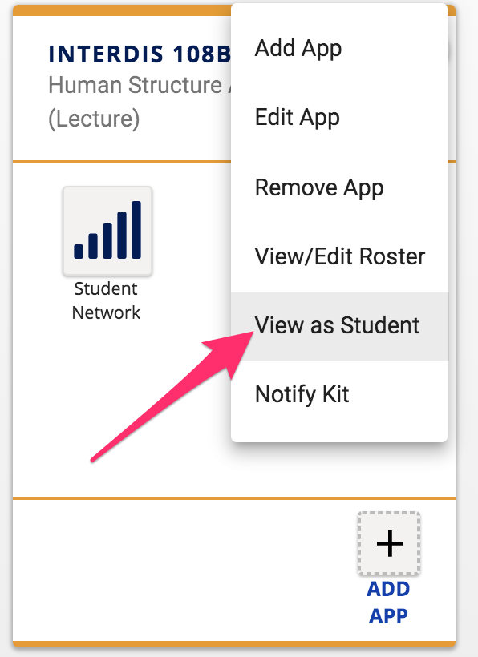
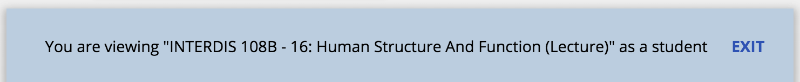
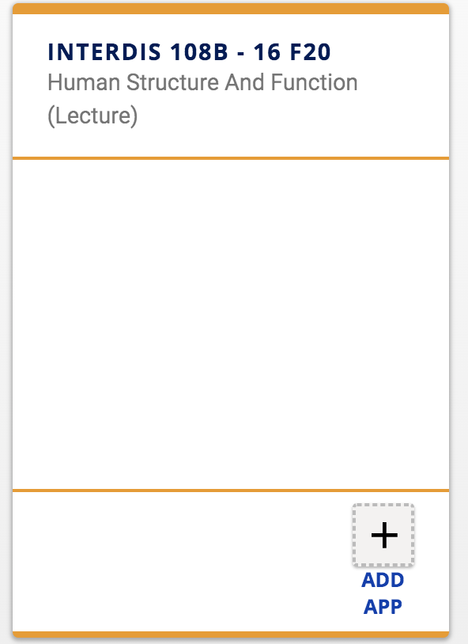
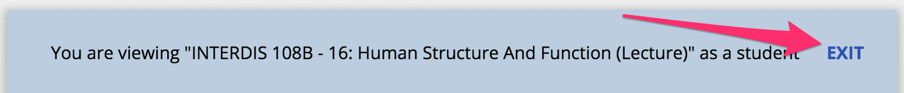
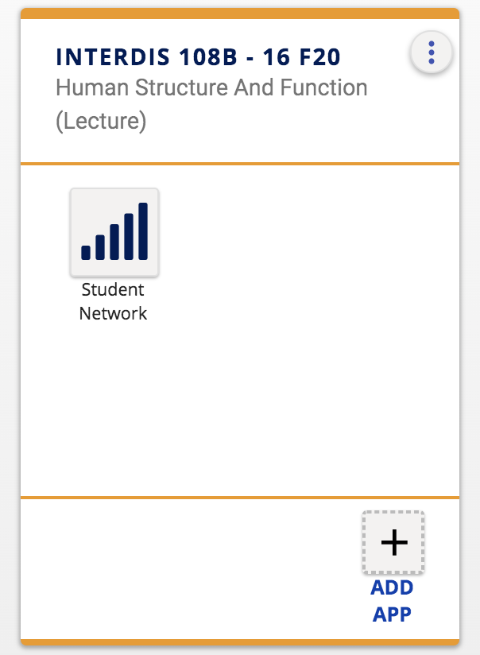

## How do I view my kit with the student role? 

If you have shared an app in your kit that is only available to instructors and assistants (TAs), you can confirm that these apps are not visible to students by using the **View as Student** feature.

In the kit you wish to view in student mode, **click the menu with three vertical dots**  in the upper-right corner of your kit.  Then click **View as Student** in the menu.

You will see a blue bar at the bottom of Kits stating you are viewing your kit as a student.

**Any apps not shared with students should disappear from view**.  In this example, the Student Network app, which is only visible to instructors and assistants, disappeared from the kit.

**Click Exit** on the blue bar to exit student view mode for your kit.

All apps will be visible in the kit after exiting student view mode.

