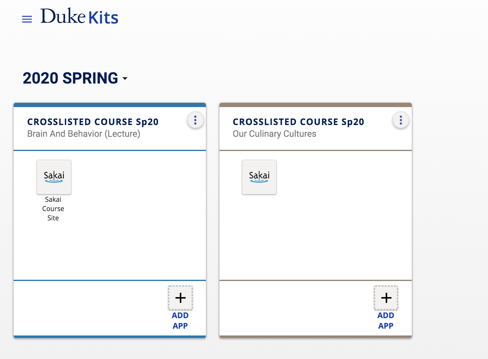
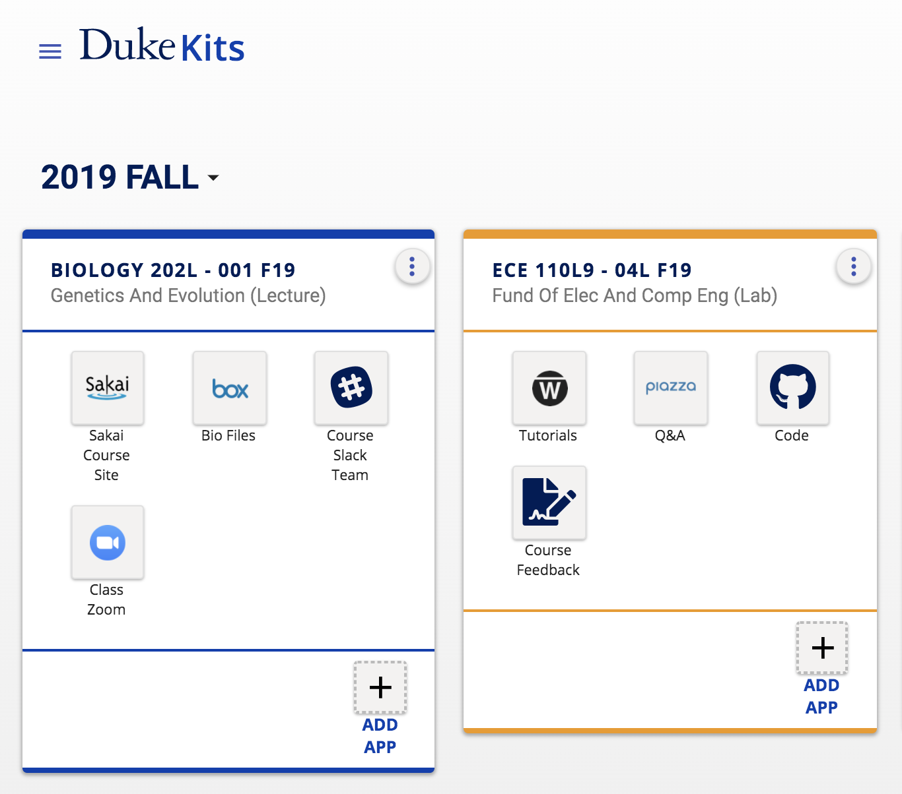
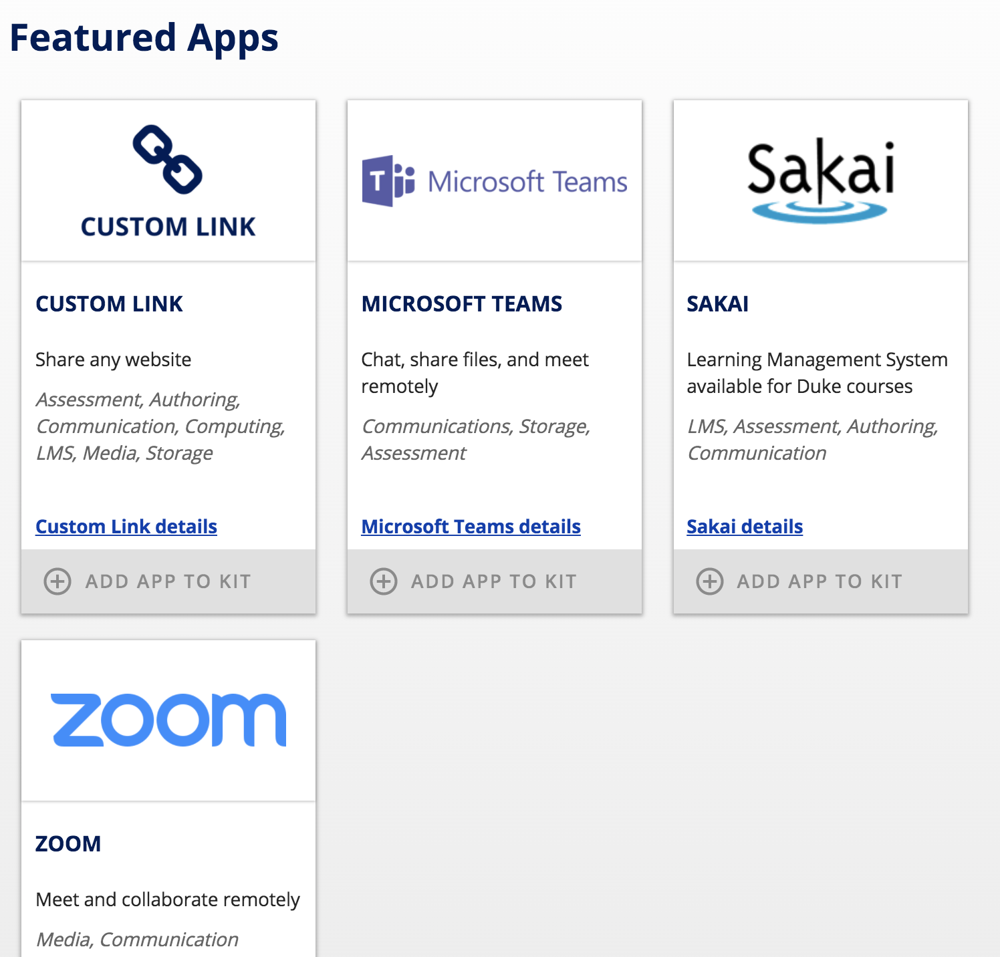

## What is Kits?

Kits ([https://kits.duke.edu](https://kits.duke.edu)) gives you one place to go where you can manage all the apps that you use in your course. When faculty login to Kits, they see a card or "kit" for every course for which they are an instructor in DukeHub.

If you have created a Sakai site for your course, you will see an icon for the Sakai app in your kit.  Otherwise, your kit will be empty.

Your course kit is automatically shared with all students in the course roster.  As students drop and add the course, the kit membership is automatically updated.

When you add apps to your kit, the apps are shared with everyone who is a member of the kit.  This includes all students currently in your roster, and anyone you add manually to the kit.

## Why would I use Kits?

### Save Setup Time

Faculty who use many learning apps to teach their course can streamline the setup and sharing of these tools with students by using Kits.

### Make Life Easier for Students

Kits also provides a single place for students to access all the apps used for their courses.

### Find the Right Learning App

The Kits App Store makes it easy to see all the learning apps available, and provides pedagogical information on each app to make finding the right one for your teaching needs easy.

While some apps in the App Store are also available in Sakai, many apps such as MS Teams, Sites@Duke (WordPress), Box, and Panopto can only be set up and shared automatically with your course roster by using Kits.

Ready to get started using Kits?  [Learn how to create a kit](/how-do-i-create-a-kit.md).
