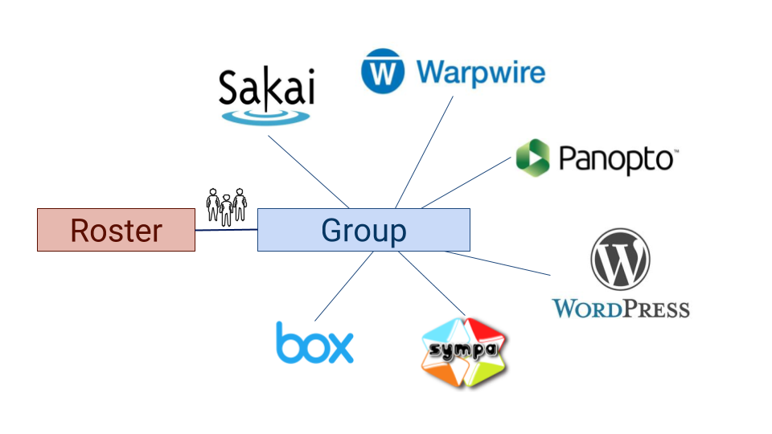

# Kits

[Kits at EDUCAUSE 2018](https://docs.google.com/presentation/d/1FPo0xX9Xs2rOJMoA2KAAS_dcv5qB_T8XWwILnDmyq2s/edit?usp=sharing)

## Scope

Kits is an effort to modernize the learning technology ecosystem around [NGDLE](//ngdle.org) concepts.

The current state of Learning Technologies has focused primarily on meeting faculty's teaching needs through the Learning Management System.

This contradicts our vision of the ideal university IT and academic culture. A culture of technological plurality and choice.

For university IT, relying on any single solution, including the LMS, is a short-sighted strategy that provides suboptimal learning experience as a monolithic system cannot provide the best learning experience for all aspects of all learning communities.

    The best learning happens when appropriate apps are used in conjunction with active learning pedagogies.

## How Kits Works

For faculty, Kits allows them to start with the official roster of students and add folks like teaching assistants, collaborating faculty, support staff, or librarians, creating a group.

Faculty then turn on the apps they want to use with this group, and Kits gives everyone appropriate access to all the apps at once. 

This combination of group + apps is called a kit.

We're starting with courses, but the kit concept can be applied to all learning experiences someone might encounter with a university.

### Project Goals

1. Provide students a unified interface for accessing the apps used by their kits
1. Provide faculty a catalogue of learning technologies for use in their kits
1. Allow faculty to manage membership of and technologies used by their kits
1. Provide information on learning technology management and policies.

### Stretch Goals

1. Organize Kits to work with learning experiences from pre-matriculation to alumni learning
1. Let students know what they should do next for those classes.
1. Suggest apps packages, or standard sets of app combinations, to help faculty accomplish their learning objectives.
1. Solicit suggestions for new apps Duke should support, then Duke can research support, automation and provisioning behind the new apps. 

## Built With

* [Ruby on Rails](https://rubyonrails.org/) - Backend Framework
* [React](https://reactjs.org/) - Frontend Framework
* [Grouper](https://spaces.at.internet2.edu/display/Grouper/Grouper+Wiki+Home) - Group Management
* [Shibboleth](https://wiki.shibboleth.net/confluence/display/NEWS/) - Single Sign On
* [Learning Tools Interoperability (LTI)](https://www.imsglobal.org/activity/learning-tools-interoperability) - Integration Standard

## Terms

Term | Our definition | |
-----|---------------|---
kit | Functionally, for the time being, a course. Technically, a context that ties a Grouper group for a roster + guests to apps used by that group. May also be referenced as a learning community 
App | A technology used by a kit in the context of learning that is listed in /apps. Not limited to enterprise licensed technologies. School, departmental, and unlicensed apps will also be listed. 
Ecosystem | All of the integrated technologies used for learning. Shortened synonym for Learning Technology Ecosystem. 
User story| "As a *who*, I want *goal* so that *reasons*". These are the specification for design and development work. Acceptance criteria written in Gerkin These are tracked via a Github Label. | [All User Stories](https://github.com/DukeLearningInnovation/kits/issues?q=is%3Aopen+is%3Aissue+label%3A%22user+story%22) 
Assumption | Unknowns that require further discussion, user research, or development iterations to be known. These are tracked via a Github Label. | [All Assumptions](https://github.com/DukeLearningInnovation/kits/issues?q=is%3Aopen+is%3Aissue+label%3Aassumption) 
Hypothesis | A question used to drive design and development deliverables that can be tested in order to learn. Help explicitly state assumptions related to user stores. These are tracked via a Github Label. | [All Hypothesis](https://github.com/DukeLearningInnovation/kits/issues?q=is%3Aopen+is%3Aissue+label%3Ahypothesis)
MVP | The minimum viable piece/thing/product/idea/design we can build to validate or invalidate a hypothesis. These are tracked via Github Milestones. | [All MVP](https://github.com/DukeLearningInnovation/kits/milestones) 
Project | Github Projects are used to track sprints | [Current projects](https://github.com/DukeLearningInnovation/kits/projects) 

## Contributing

We don't have all the answers. We can't build it all by ourselves. Whether you're in or outside of Duke, read [CONTRIBUTING.md](CONTRIBUTING.md) for more information on how you can contribute to this project.
