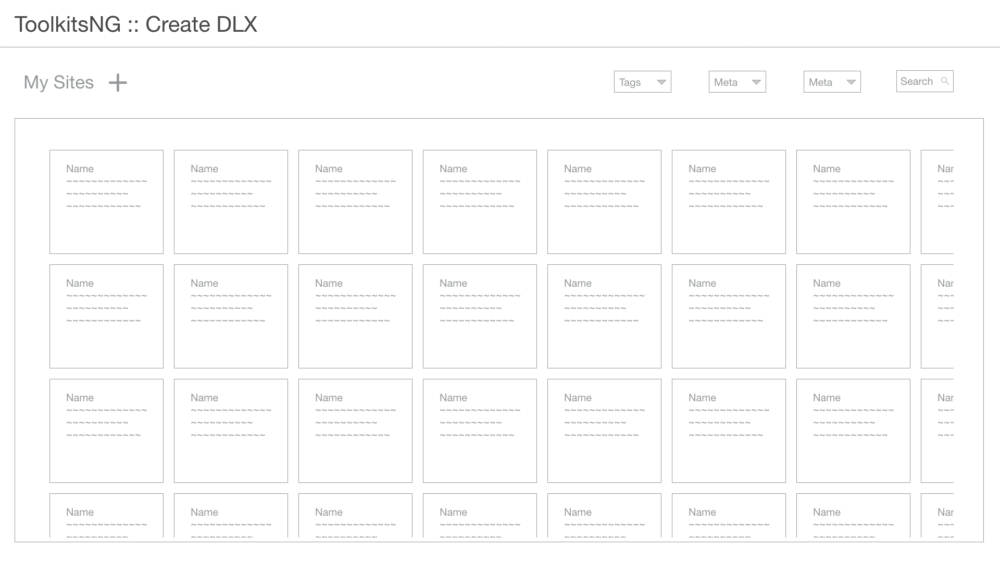
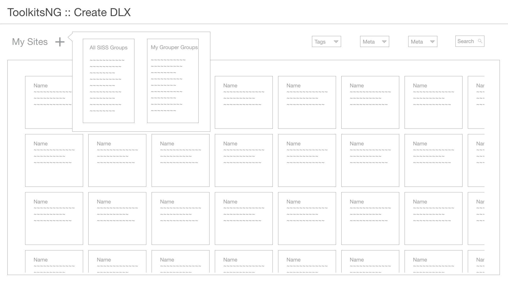
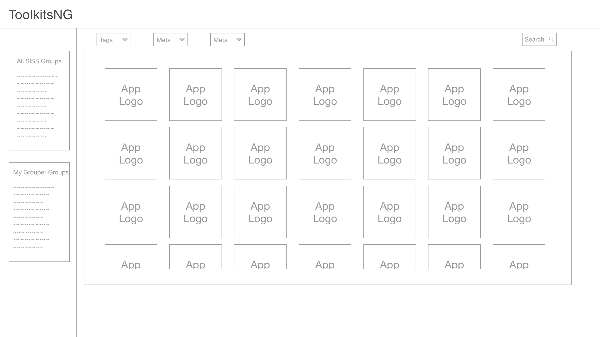
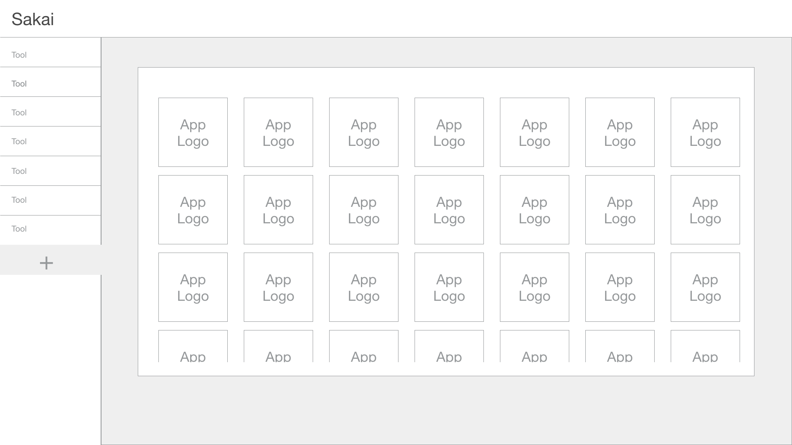
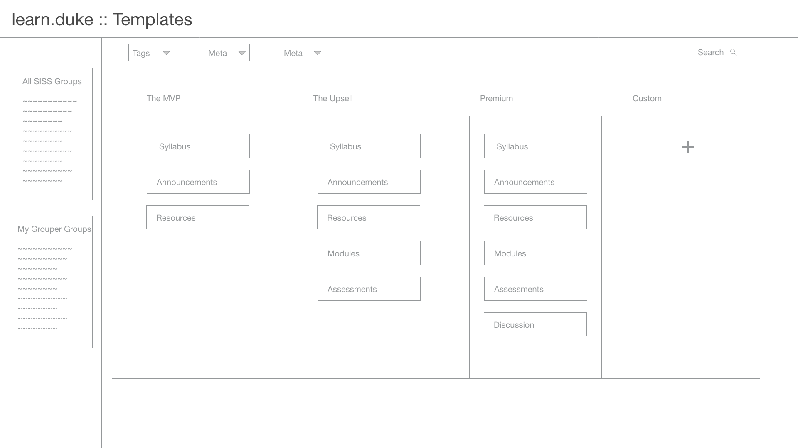
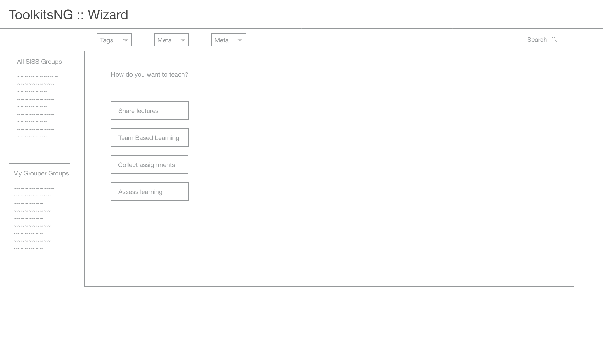
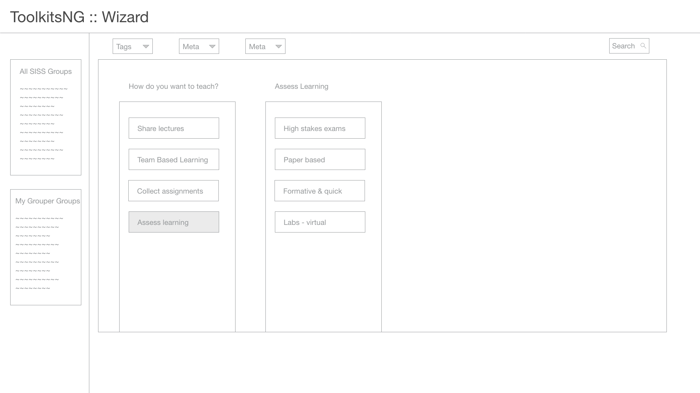
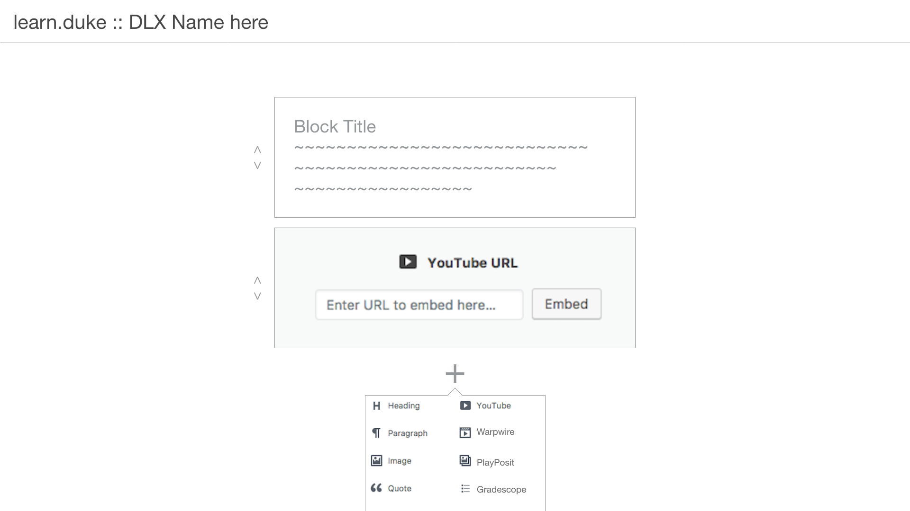
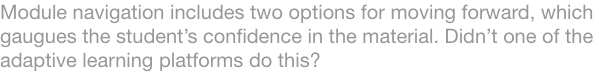

[View](https://dukelearninginnovation.github.io/learn.duke/) [Contribute](https://github.com/DukeLearningInnovation/learn.duke)

## Table of Contents
1. [Inspiration](#inspiration)
1. Goals
1. [Scope](#scope)
1. Terms
1. Actors
1. [Assumptions & hypothesis](#assumptions-&-hypothesis)
1. [Components](#components)
	1. [courses](#courses)
	1. [apps](#apps)
	1. [packages & templates](#packages-&-templates)
	1. [wizard](#wizard)
	1. [content creation](#content-creation)
	1. [cms](#cms)
	1. [dlx](#designed-learning-experience)
1. [Technical specification](#technical-specification)
1. Analytics
1. User stories
1. What is MVP1?
1. [Next steps](#next-steps)

learn.duke.edu will provide the following to the Duke community.

1. Provide a single place for students to see the classes they are in, what tools those classes are using, and what they should do next for those classes.
1. Cataloged and searchable platform of learning technologies available at Duke.
1. Provide a single place for faculty to provision groups, technologies, and integrations for their courses.
1. Suggest tool packages, or standard sets of tool combinations, to help faculty accomplish their learning objectives.
1. Solicit suggestions for new tools Duke should support, then Duke can research support, automation and provisioning behind the new tools. 
1. Provide information and workflows on learning technology management and policies. 
	* LearnTAC
	* process for how tools get added
	* minimum requirements from LTS, ITSO, procurement, accessibility, etc

Audiences and potential benefit:
	
* Students: Have all apps together, one stop shop. Place to suggest new tools.
* Faculty: single place with tools together to easily provision for a course. Select pre-packaged groups of tools commonly used. Suggest new tools they like. 
* Admins: get data of which tools are used most, and suggestions of new tools by faculty/students that Duke can research adopting/licensing. 

# Inspiration

* [Exploring the Next Generation Digital Learning Environment with Tsugi (次)](https://www.youtube.com/watch?v=OzrlFJNBFqY)
* [Grav + Canvas LMS: Markdown and Git Workflows](https://www.youtube.com/watch?list=PLVtu1bDQijapAcziv0r0BYKNapd8Or8gV&v=_Oj1JIIxlAk)
* [EDUCAUSE NGDLE PDF](/assets/educause-ngdle.pdf)

# Scope

* The scope of learn.duke is on courses at this time
* Technologies must be learning related, but are not limited to enterprise licensed. School, departmental, and unlicensed tools will also be listed
* learn.duke will be an open source licensed project

# Assumptions & hypothesis
* We hear a lot about the the cognitive load that taking 5 courses taught 5 different ways on 5 different tech stacks has on students, does this affect that positively?
* learn.duke should help clarify the LMS's role in the future
* SISS groups are auto-created, faculty don't have to create the group
* Toolkits and Sakai run as is in parallel with this effort.
* Once we are 'done' there shouldn't be a need for Toolkits anymore

> Faculty aren’t always risk takers, ‘coursera might not be around next year, so what will be here that I get guaranteed returns out of’. --Mine

* Will faculty be receptive to change when the output is their content, easily accessible and maneuverable for the future?

* Is there an opportunity for inter-institutional collaboration here?

* At the future of online at duke panel, there was  talk about networked communities of learners. Does that have a place here or is this the thing that connects you to your communities quicker/easier?
Maybe part of the UI is linking to the community that gets created for every course? Every course gets a slack channel?

---
# Components

## courses
learn.duke could act similarly to the Canvas landing page, as a dashboard that can send users to whatever server their learning experience lives on.

Now, users can access sakai, extend, sites@duke, people.duke, whatever course sites from the same place.

### courses = groups
Adding a new learning experience starts with the group selection.

groups come from groupmanager.oit API to learn.duke

### Tasks done at courses
* create course cards/sites
* manage course memberships including add TAs and guests to the reference groups like you do on Toolkits.
* complete the instructional tasks like create assignment once tools are enabled

### Questions for courses
* What happens with cross-listed courses? Is there a master group that's created?

## apps
A new service that contains a database of all learning technologies around the university.

* All apps and their apis
* presented via API to learn.duke or does it have it's own UI?

An app store UI built that allows searching/filtering for apps and has grouper group awareness.

A new interface for selecting and managing these apps in Sakai, indicated here by the + button on the left navigation. This overrules site info::manage tools

This calls the app store, but the UI is changed slightly as the interface knows it's inside Sakai via LTI and already knows what what group context we're in.

This should be applied to all platforms, wordpress, drupal, open edx, sakai.

### Tasks done at apps
* turn on the tools
* configure tools
* basic add url of specific tool or block for things not in the ecosystem
* usage metrics
* discipline specific app management

### Questions on apps
* Should we include 'advertising' space for whatever apps we want to push at any given time? A featured, section.
* Do we build in a rating system for each app?
* What is a good metric for 'used' in a course? The existence of a tool in Sakai means nothing when that tool is part of the template. 2 create.tool events or existence of 1 item in the sakai-db?

## packages & templates

Several creation interfaces will be tested and built to accommodate the spectrum of users.

Shown here, pre-built templates that select tools based upon group context or other criteria.

### Tasks done at packages & templates
* none entered at this time

### Questions on packages & templates
* none entered at this time

## wizard
Shown here, a three step wizard that walks users through ways of teaching and what tools are offered.

### Tasks done at wizard
* none entered at this time

### Questions on wizard
* none entered at this time

## content creation

A new way to create learning content, it is the evolution of the syllabus. It competes not against the LMS, but against the word doc.

> Making the UX feel effortless is really, really hard, but is the point. It's what makes it next gen.

> Remember, users don't want to use your app, they want to be done using your app. Faculty don't want students to watch a video, watching a video isn't learning. They want to have tomorrow's in class discussion about the meaning of the video.

An opposing model to apps, templates, and wizard, content creation focuses on just in time provisioning of a tool (LTI, CI, or API). Don't make a faculty click add warpwire, configure warpwire. Show them an add video button and when they click it, add and configure warpwire for their course in the time it takes the textbox to appear so they can either paste their youtube URL in or click the Warpwire icon. 

There is no site info::manage tools. There is only create course content

Inspired by Wordpress Gutenberg, content will be managed by the block. There will be standard text and web blocks that furl and unfurl content.

But there will also be content item blocks for all IMS Content Item integrations.

### Evolve the syllabus
1. ingest .docx syllabus
2. convert to web format
3. run course
4. export .docx 

### Integrate with apps
1. upload syllabus
2. scan 4 keywords
3. suggest tech w/ found options
4. convert docx to md and web
5. find resources for eReserves and add links to them

### Course content with an open-first mindset
Sharing doesn't have to mean exposing your students and the safe spaces we create for them to assess and discuss their learning. Consumer apps have solved this.

* export content to social networks
* export calendar
* export to sites@duke
* export to medium

Content created on the platform is abstracted from the course specific metadata making it more sharable.

### Tasks done at content creation
* none entered at this time

### Questions on content creation
> MS Word vs Google docs. The paradigm shift was about people. Real time collaboration vs single user document creation.

* What is the paradigm shift from the status quo to this?

* Should this be a git-backed learning object repository of some kind? Or feed into it at least?

## CMS

### Tasks done at cms
* suggest an app be added to appdb
* learnTAC info
* policies on how learning technologies are managed
* blog
* * learnplatform like community around apps (profmikegreene not sure about this one)

### Questions on cms
* none entered at this time

## Designed learning experience
Users use a wide variety of tools in their everyday life, the tools update regularly, the users switch between them regularly.

Users want this agency in their learning experience. They want intuitive variety of their choosing.

This doesn't mean the LMS goes away, it does shift priorities away from it.

This doesn't mean we focus on making things 'prettier', it does mean we focus on the whole teaching and learning experience.

The smart phone is a good metaphor. Users are provided a default set of apps, like Safari, that represent the starting point, not the majority of functionality the phone is capable of.

They are also presented with an app store containing varied means of introducing new functionality and apps, like Chrome and Firefox, to them.

App developers use Application Programming Interfaces or APIs to bridge the gap between their ideas and users. APIs give developers the power to do almost anything

The learning technology ecosystem will contain all the pieces of this metaphor. 

* default apps (like the LMS or Box)
* app store (curated lists of approved or supported apps)
* app developers (both in and outside the university)
* APIs (connection points for users and app developers to customize their experience)

This results in a very specifically designed user experience the first time each user picks up a new phone and tremendous agency to customize that experience to meet their needs.

Provide students with a singular designed learning experience that pulls in the data from all tools connected to a course and streamlines the presentation of what to do next into something like Coursera or edX

> Design is solving a problem. Many things have to be designed before you approach the field of visual design and decide how things look.

The ecosystem is a shift in priority from administration of courses to designed experiences for teachers and learners.

This doesn't mean the LMS goes away
This doesn't mean things are 'prettier'

This means we, the stewards of the ecosystem, consider the whole experience of what it means to offer learning and to receive learning at Duke.

The learning technology ecosystem would provide intuitive, designed experiences for teachers and learners to do the following.

## Elements
### Assessment
* rubrics
* outcomes
* assignments
* ePortfolios
* credentials
* badges
* classroom response

### Authoring
* lessons
* learning pathways
* web hosting

### Communication
* web conferencing
* discussions

### Computing
* labs
* laptops
* devices
* research computing resources

### Learning Management
* gradebook
* groups
	* rosters	
* experience progression
* calendar

### Media
* media management
* lecture capture
* production

### Storage
* file management
* eText
* restricted resources

### Capabilities
Services and experiences have the ability to:

* Batchable - select multiple, perform action
* Groupable - connect to groups of users
* Gradeable - assign value
* Adaptable - be part of a pathway
* Collaboratable - users interact simultaneously
* Annotatable - allow feedback and context
* Openable - extended to outside groups
* Programmable - have APIs
* Trackable - create events for analytics
* AIable - can attach intelligence

### An Example
Let's walk through an example faculty experience with some of the current technologies used to accomplish them.

1. View the courses they are teaching this semester (DukeHub)
2. View the details and roster for a single course (DukeHub)
3. Build a syllabus for the course (Word)
4. Store the syllabus somewhere accessible to the roster (Sakai, Box, Email)
5. Build content and activities to support the goals described in the syllabus (Word, Sakai, Class discussion, lecture *sigh*)
6. Build assessments to evaluate how well the content supports those goals (Sakai, Clickers, Scantron, PebblePad)
7. Grade assessments and provide feedback (Red ink pen, Sakai, Word)

Level 1 - 

Level 2 - 

Level 3 - 

Level 4 - configurable experience that gives faculty choice

Today, most faculty are somewhere between links on a departmental webpage out to the various steps and app with a Duke header bar that embeds each step into the page, i.e. the LMS. 

Coursera is a move in the right direction in that it's a single interface for program and course management, teaching, learning, and credentialing. But the experience is limited to what they define.

A single, designed experience that requires each step to be done inside of the design it dictates ecosystem model would reduce the switching costs of moving between tools and user interfaces.  

A level 4 ecosystem doesn't care what system faculty use to store a syllabus, it offers a single interface to create stuff, upload stuff, and store stuff. 

If faculty want to use Box instead of Sakai Resources, it's just a checkbox in a setting somewhere, not a completely different experience.  

Instead of having to think where do I upload this file to, faculty just upload the file to the desired default location they've chosen.

### Tasks done at DLX
* none entered at this time

### Questions on DLX
* none entered at this time

---

# Technical specification

* [LRNWebComponents](https://github.com/LRNWebComponents/ontology)
* [tsugi](https://github.com/tsugiproject/tsugi)
* [LRNWC HAX Editor](https://lrnwebcomponents.github.io/hax-body/components/hax-body/)
* IMS Deep Linking
* IMS LTI Advantage
* IMS Caliper

---

# Next steps

Give us something to test with her students, other faculty, and Duke community and build the narratives around how to communicate these ideas.

- [ ] create a courses mockup using Negotiation DLX module
- [ ] create a content creation mockup using Negotiation DLX module

