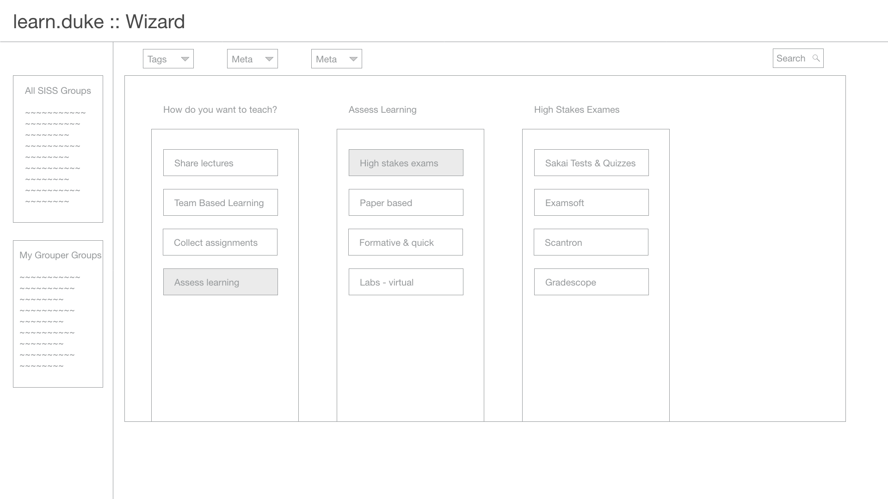

# wizard
Shown here, a three step wizard that walks users through ways of teaching and what tools are offered.

## Tasks done at wizard
* none entered at this time

## Questions on wizard
* none entered at this time
